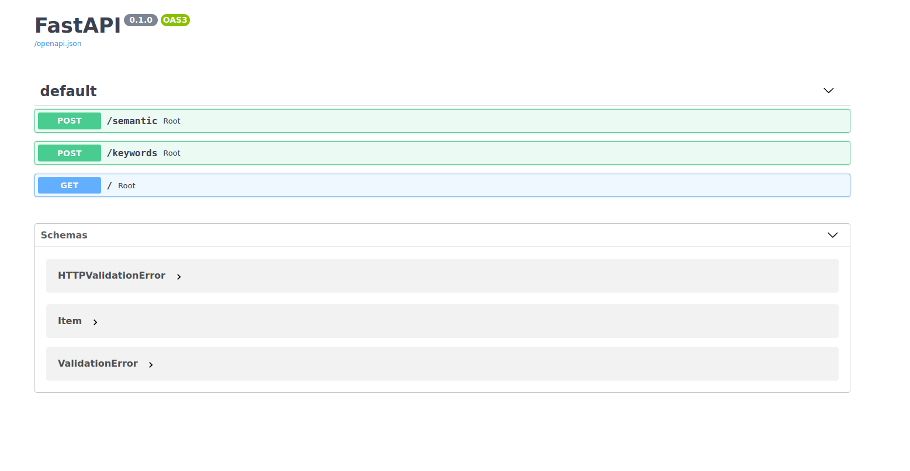
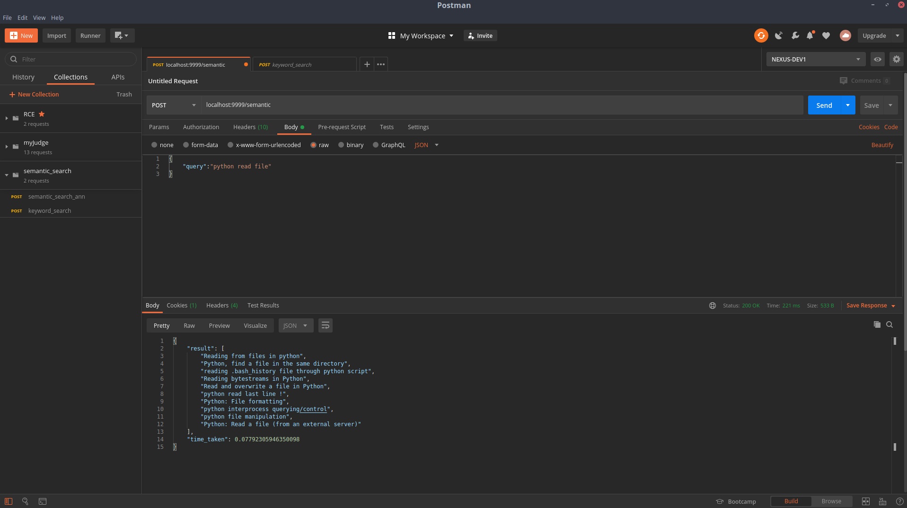

# Semantic Search Engine
This API returns the top 10 similar results for a user query.10% of Stackoverflow's data is used. 
You can find it [here](https://www.kaggle.com/stackoverflow/stacksample).

## Getting Started

These instructions will get you a copy of the project up and running on your local machine for development and testing purposes.

### Prerequisites

* docker
* python
* tensorflow
* flask / fastapi

### Installation

1. Clone the repo
```sh
https://github.com/budukhyash/semantic-search-engine
```
2. Running this will start open distro's elastic search instance. Read more about it [here](https://opendistro.github.io/for-elasticsearch-docs/)
```sh
docker run -p 8200:9200 -p 8600:9600 -e "discovery.type=single-node" amazon/opendistro-for-elasticsearch:1.8.0 
```
3. Download the [dataset](https://www.kaggle.com/stackoverflow/stacksample). extract it, download the [USE4](https://tfhub.dev/google/universal-sentence-encoder/4) 
Universal Sentence Encoder by Google. Make sure 
the downloaded files are in the directory of the repository.

4. For data ingestion run. X denotes the number of documents to be indexed.
```sh
example => python elastic_search_ingestion.py X
python elastic_search_ingestion.py 20000
```
5.After the ingestion is completed. You can start the server by running
```sh
uvicorn server:app --reload --port 9999
```
<!-- USAGE EXAMPLES -->
## Documentation
[Postman collction](https://documenter.getpostman.com/view/11156949/T17J9mzC?version=latest)
After starting the server docs can be found here.
- http://localhost:9999/docs#/ 
- You should see something like this.
-
- /semantic returns the top 10 most similar results, this considers the semantic meaning of the query and uses cosine similarity to rank the documents.
- /keywords returns the most similar results , this uses the traditional keyword approachusing an inverted index.Elastic search uses a TF-IDF based scheme to rank these documents. 

6. Response time (Ingested 1 lakh documents)
- sub 300ms for semantic search 
- sub 150ms for keyword based search.
 
 

## Built With
* [Python](https://www.python.org/)
* [Tensorflow](https://tfhub.dev/) 
* [Fastapi](https://fastapi.tiangolo.com/)         
* [Flask](https://flask.palletsprojects.com/en/1.1.x/)     

